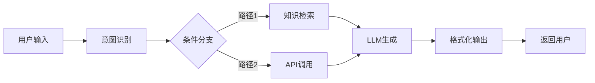
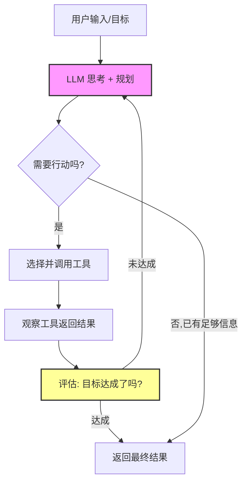
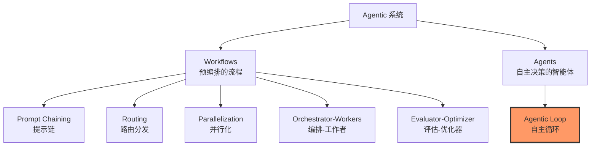
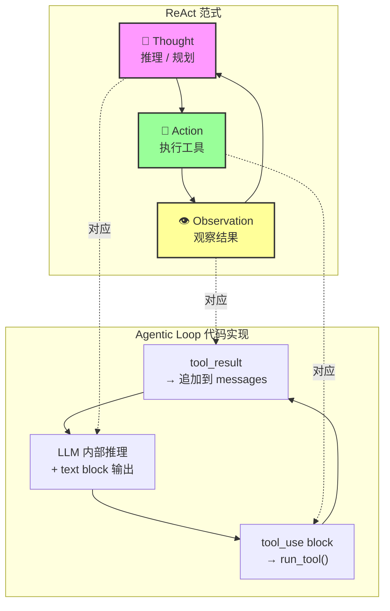
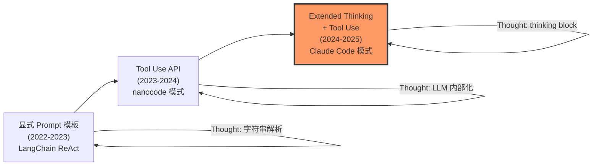
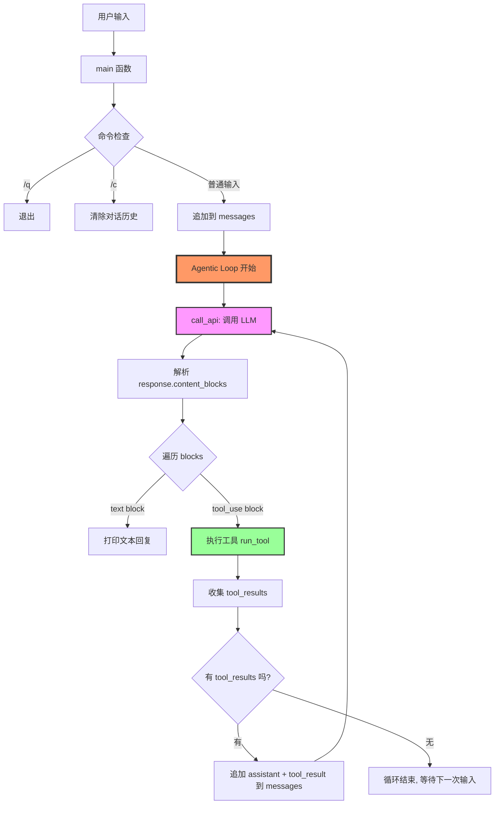
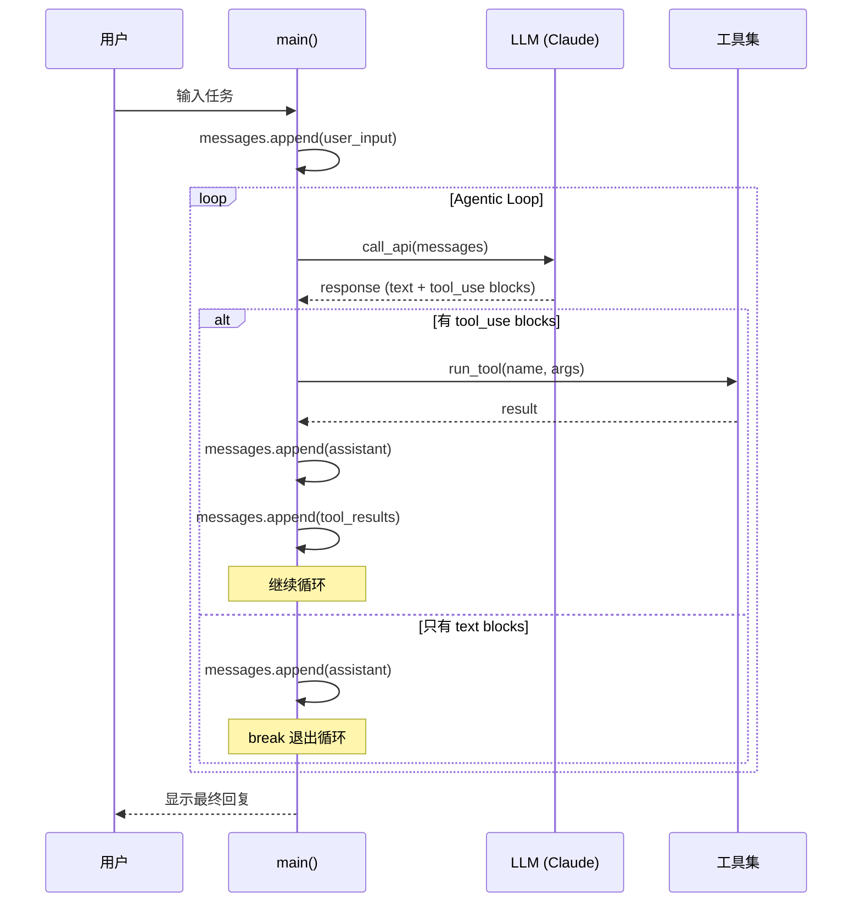

# Agentic Loop 完全指南：理论、ReAct 范式与 nanocode 源码分析

> 本文档整合了 Agentic Loop 的理论分析、ReAct 范式的深度解读、以及 nanocode 项目的源码剖析，
> 帮助你从概念到代码，彻底理解现代 AI Agent 的核心运作机制。

---

# Part I：Agentic Loop vs 固定 Workflow

> **背景**：Agentic Loop 会取代固定 Workflow。当时 Coze 这类通过固定工作流编排的方案非常流行，但 Agent 会比 Workflow 灵活得多。现在回头看，几乎所有的 AI 产品都在转向 Agent 模式。

---

## 一、Workflow（固定工作流）vs Agentic Loop（智能体循环）

### 1. 固定 Workflow 模式

以 Coze、Dify 等平台为代表，Workflow 模式的核心思想是：**由人类预先设计好执行流程**。

```
用户输入 → 节点A（意图识别）→ 节点B（知识检索）→ 节点C（LLM生成）→ 节点D（格式化输出）→ 返回
```



**特点**：
- 流程是**预定义的、确定性的**（DAG 有向无环图）
- 每个节点的输入/输出是**固定 schema**
- 分支逻辑靠 if-else 条件判断
- 开发者必须**提前穷举所有可能的路径**

**局限**：
- 面对开放性问题，分支会爆炸式增长
- 无法处理"意料之外"的情况
- 一旦某个节点失败，整个流程大概率崩溃
- 本质上是**人类思维的硬编码**，LLM 只是流程中的一个"执行工具"

---

### 2. Agentic Loop 模式

Agentic Loop（智能体循环）的核心思想完全不同：**让 LLM 自己决定下一步做什么**。



**核心循环只有三步**：

```
while (目标未达成):
    1. Think（思考）：分析当前状态，规划下一步
    2. Act（行动）：选择合适的工具/动作执行
    3. Observe（观察）：查看执行结果，评估进展
```

这就是经典的 **Think → Act → Observe** 循环，也叫 **ReAct 范式**。

**关键区别**：

| 维度 | 固定 Workflow | Agentic Loop |
|------|-------------|--------------|
| 决策者 | 人类（设计时） | LLM（运行时） |
| 流程 | 预定义、确定 | 动态生成、自适应 |
| 错误处理 | 预设异常分支 | 自主重试/换策略 |
| 工具使用 | 固定顺序调用 | 按需选择调用 |
| 复杂度上限 | 受限于设计者想象力 | 受限于 LLM 能力 |
| 类比 | 流水线工人 | 独立思考的员工 |

---

## 二、Agentic Loop 的具体工作原理

以一个真实场景为例 —— "帮我修复代码中的 bug"：

### Workflow 模式的做法

```
输入代码 → 静态分析 → 匹配已知bug模式 → 生成修复 → 输出
```

如果 bug 不在已知模式中，就束手无策。

### Agentic Loop 的做法

```
Loop 1: Think - "先读取报错信息，理解问题"
         Act  - 调用 read_file 读取错误日志
         Observe - 发现是 NullPointerException

Loop 2: Think - "需要找到出错的源文件"
         Act  - 调用 grep_search 搜索相关代码
         Observe - 找到了 3 个相关文件

Loop 3: Think - "看看这几个文件的具体实现"
         Act  - 并行调用 read_file 读取 3 个文件
         Observe - 发现 fileB.java 第 42 行缺少空值检查

Loop 4: Think - "需要添加空值检查来修复"
         Act  - 调用 edit_file 修改代码
         Observe - 修改完成

Loop 5: Think - "应该验证修复是否正确"
         Act  - 调用 terminal 运行测试
         Observe - 测试全部通过 ✅ → 目标达成，退出循环
```

**关键设计要素**：

1. **工具集（Tool Set）**：Agent 可用的所有能力（读文件、搜索、执行命令、编辑代码等）
2. **上下文窗口（Context Window）**：Agent 的"工作记忆"，存放历史对话 + 工具结果
3. **系统提示词（System Prompt）**：定义 Agent 的行为规范、策略偏好
4. **终止条件**：什么时候停止循环（目标达成/达到最大步数/用户中断）

---

## 三、Claude 当下的设计方法

Anthropic 在 Agent 设计上有一套非常清晰的方法论，2025 年初他们发布了官方的 Agent 设计指南，核心思想可以概括为：

### 1. "能用简单方案就不用复杂方案"

Anthropic 把 AI 系统分为两大类：



他们的建议是：**从最简单的方案开始，只在必要时增加复杂度**。

- 能用单次 LLM 调用解决的，就不要上 Workflow
- 能用简单 Workflow 解决的，就不要上 Agent
- Agent 适用于**开放性强、步骤不确定、需要自主决策**的场景

### 2. Claude 的 Agentic Loop 实现

Claude（尤其是 Claude Code）的 Agent 模式核心就是一个朴素的循环：

```python
# 伪代码：Claude Agent 的核心循环
def agent_loop(user_goal, tools, system_prompt):
    messages = [system_prompt, user_goal]
    
    while True:
        # 1. LLM 思考 + 决定下一步
        response = claude.generate(messages)
        
        # 2. 如果 LLM 认为任务完成，返回结果
        if response.is_final_answer:
            return response.content
        
        # 3. 如果 LLM 决定调用工具
        if response.has_tool_calls:
            # 并行执行所有独立的工具调用
            results = execute_tools(response.tool_calls)
            # 把工具结果加入上下文
            messages.append(response)
            messages.append(results)
        
        # 4. 回到循环顶部，LLM 继续思考
```

### 3. 关键设计原则

#### （1）工具设计是核心

Anthropic 强调：Agent 的能力上限取决于工具设计的质量。好的工具应该：

- 有清晰的描述（让 LLM 知道什么时候该用）
- 有明确的输入/输出 schema
- 做好错误处理（返回有意义的错误信息而非崩溃）
- 原子性（一个工具做一件事）

#### （2）Agentic Coding 就是最好的例子

Claude Code 就是一个典型的 Agentic Loop 产品：

- 你给它一个目标（"帮我重构这个模块"）
- 它自己决定：先搜索代码 → 理解结构 → 制定计划 → 逐步修改 → 验证结果
- 中间任何一步出问题，它会自主调整策略

#### （3）Extended Thinking（扩展思考）

Claude 引入了 "think" 阶段，让 LLM 在调用工具之前有一个**显式的内部推理过程**，这提高了：

- 规划质量（想清楚再行动）
- 错误恢复能力（反思哪里出了问题）
- 工具选择的准确性

#### （4）并行工具调用

Claude 支持在一次响应中同时调用多个独立工具，大幅提升效率。比如需要读取 3 个文件，不是串行读取，而是一次性并行读取。

---

## 四、为什么 "几乎所有 AI 产品都在转向 Agent 模式"

核心原因是：**LLM 能力的提升让 Agent 模式变得可行了**。

2023 年初，LLM 的规划能力还很弱，经常"跑偏"，所以用固定 Workflow 来约束它是合理的。但到了 2025 年：

1. **模型推理能力大幅提升**：Claude 3.5/4、GPT-4o 等模型的规划和工具调用准确率已经非常高
2. **成本大幅下降**：多轮调用的成本变得可接受
3. **用户需求更开放**：用户不想被限制在预定义的流程里
4. **Workflow 的维护成本越来越高**：随着功能增多，DAG 越来越复杂，难以维护

用一句话总结：**Workflow 是人类思维的硬编码，Agent 是让 AI 用自己的方式思考**。当 AI 足够聪明时，后者天然更灵活、更强大。

---

## 五、但 Workflow 并未完全消失

需要指出的是，在以下场景中，固定 Workflow 仍然有价值：

- **合规/审计场景**：需要确定性的执行路径
- **高频简单任务**：固定流程更快、更省 token
- **安全关键场景**：不希望 AI 有过多自主权

现实中最好的方案往往是**混合模式**：用 Agent 做高层决策，用 Workflow 做确定性子任务。Claude 自己也是这样的 —— 整体是 Agentic Loop，但内部对某些操作（如文件编辑）有确定性的流程约束。

---
---

# Part II：ReAct 范式深度解读 —— 它在 Agentic Loop 中到底怎么体现？

> **核心问题**：Agentic Loop 看起来就是一个简单的 while 循环，那常说的 ReAct 到底在哪里？它真的"就这么简单"吗？

---

## 一、ReAct 是什么？

**ReAct**（**Re**asoning + **Act**ing）来自 2022 年 Yao et al. 的论文 *"ReAct: Synergizing Reasoning and Acting in Language Models"*。它的核心贡献是：

> **让 LLM 在行动之前先"说出"自己的推理过程，然后根据行动结果再推理，形成 Thought → Action → Observation 的闭环。**

在 ReAct 之前，LLM 的使用有两种割裂的范式：

| 范式 | 做法 | 问题 |
|------|------|------|
| **纯推理（CoT）** | 让 LLM 一步步思考，直接给出答案 | 容易"幻觉"，无法获取真实信息 |
| **纯行动（Act-only）** | 让 LLM 直接调用工具，不显示思考 | 行为不可预测，容易选错工具 |

ReAct 的突破在于：**把两者融合在一起**。每个循环都包含三个阶段：

```
Thought: "我需要查找 Python 的 os.path 模块文档来回答这个问题"
Action:  search["Python os.path module documentation"]  
Observation: "os.path — Common pathname manipulations. This module implements..."
```

---

## 二、但是……nanocode 里没看到 "Thought" 啊？

这是最关键的问题。让我们回到 nanocode 的核心循环：

```python
while True:
    response = call_api(messages, system_prompt)
    content_blocks = response.get("content", [])
    tool_results = []

    for block in content_blocks:
        if block["type"] == "text":          # ← 这里
            print(...)
        if block["type"] == "tool_use":      # ← 这里
            result = run_tool(...)
            tool_results.append(...)

    if not tool_results:
        break
    messages.append({"role": "user", "content": tool_results})
```

表面上看，代码里没有任何 "Thought" 的显式痕迹。**但 ReAct 确实在这里完整体现了 —— 只是体现的方式和你想象的不同。**

---

## 三、ReAct 三阶段在 Agentic Loop 中的精确映射

### 📍 总览映射



### 阶段 1：Thought（推理） → LLM 的内部推理 + text block

**这是最容易被忽视的部分。**

在原始 ReAct 论文中，Thought 是 LLM 生成的一段**显式推理文本**，例如：

```
Thought: The user wants to fix a NullPointerException. I should first read the 
error log to understand where it occurs, then find the relevant source file.
```

在 nanocode / Claude Code 的实现中，这个 Thought 阶段发生在**两个层面**：

#### 层面 A：LLM 内部的隐式推理

当 `call_api()` 被调用时，Claude 在生成响应之前，**内部已经完成了推理**：
- 分析当前 messages 中的所有信息
- 评估目标是否达成
- 规划下一步该做什么
- 决定调用哪个工具、传什么参数

这个推理过程**隐含在模型的 forward pass 中**，你看不到它，但它确实发生了。

#### 层面 B：text block 中的显式推理

Claude 经常在 `tool_use` block 之前输出一段 `text` block，解释自己在做什么：

```json
{
  "content": [
    {"type": "text", "text": "Let me read the error log to understand the issue."},
    {"type": "tool_use", "name": "read", "input": {"path": "error.log"}}
  ]
}
```

这段 `"Let me read the error log..."` 就是**显式的 Thought**！它出现在 nanocode 代码的这个位置：

```python
for block in content_blocks:
    if block["type"] == "text":                    # ← 🧠 Thought 的显式体现
        print(f"\n{CYAN}⏺{RESET} {render_markdown(block['text'])}")
    if block["type"] == "tool_use":                # ← 🔧 Action
        ...
```

#### 层面 C：Extended Thinking（更深层的 Thought）

Claude Code 还支持 **Extended Thinking** —— 在响应中有一个专门的 `thinking` block：

```json
{
  "content": [
    {"type": "thinking", "text": "The error is on line 42 of fileB.java. The variable 'user' could be null when..."},
    {"type": "text", "text": "I found the issue. Let me fix it."},
    {"type": "tool_use", "name": "edit", "input": {...}}
  ]
}
```

这个 `thinking` block 是**最纯粹的 Thought** —— 专门用于推理、不展示给最终用户。nanocode 没有实现这个，但 Claude Code 有。

---

### 阶段 2：Action（行动） → tool_use block + run_tool()

这是最直观的部分。ReAct 的 Action 直接对应 nanocode 中的工具执行：

```python
if block["type"] == "tool_use":               # ← LLM 决定执行什么 Action
    tool_name = block["name"]                  # ← 选择哪个工具
    tool_args = block["input"]                 # ← 传什么参数
    result = run_tool(tool_name, tool_args)    # ← 实际执行
```

**关键点**：LLM 不只是"调用工具"，它在**选择**调用什么工具、传什么参数 —— 这个选择本身就蕴含了 Thought 阶段的推理结果。

例如，LLM 需要在 6 个工具中选择：
- 为什么选 `grep` 而不是 `read`？—— 因为它推理出"需要在多个文件中搜索关键词"
- 为什么传 `{"pat": "NullPointer", "path": "src/"}` 而不是别的参数？—— 因为它从上下文推理出了搜索范围

**工具选择和参数构造本身就是推理的产物。**

---

### 阶段 3：Observation（观察） → tool_result 追加到 messages

ReAct 的 Observation 对应 nanocode 中将工具结果塞回 messages：

```python
tool_results.append({
    "type": "tool_result",
    "tool_use_id": block["id"],
    "content": result,                         # ← 工具返回的结果（Observation）
})
# ...
messages.append({"role": "user", "content": tool_results})  # ← 喂回给 LLM
```

**这一步的精妙之处**：工具结果以 `"role": "user"` 的形式追加到 messages。这意味着**下一轮 LLM 调用时，它能"看到"上一步行动的结果**，从而进入下一轮 Thought。

---

## 四、完整的 ReAct 循环：一个具体的例子

让我们用 nanocode 的实际执行流程来追踪一个完整的 ReAct 循环：

**用户任务**：`"Fix the TypeError in app.py"`

```
┌─────────── 循环 1 ───────────┐
│                               │
│  🧠 Thought (LLM 内部推理):  │
│  "需要先读取 app.py 了解报错" │
│                               │
│  → text block:               │
│  "Let me read app.py first." │
│                               │
│  🔧 Action:                  │
│  tool_use: read({path:"app.py"})  │
│                               │
│  👁 Observation:              │
│  tool_result:                │
│  "  1| import json           │
│    2| def process(data):     │
│    3|     return data['key'] │
│    ..."                       │
│                               │
│  → 追加到 messages, 继续循环  │
└───────────────────────────────┘
          ↓
┌─────────── 循环 2 ───────────┐
│                               │
│  🧠 Thought (LLM 推理):      │
│  "第3行 data['key'] 没有类型  │
│   检查，data 可能不是 dict"    │
│                               │
│  → text block:               │
│  "Found the issue on line 3. │
│   Adding type checking."     │
│                               │
│  🔧 Action:                  │
│  tool_use: edit({            │
│    path: "app.py",           │
│    old: "return data['key']",│
│    new: "if isinstance(data, │
│      dict): ..."             │
│  })                          │
│                               │
│  👁 Observation:              │
│  tool_result: "ok"           │
│                               │
│  → 追加到 messages, 继续循环  │
└───────────────────────────────┘
          ↓
┌─────────── 循环 3 ───────────┐
│                               │
│  🧠 Thought (LLM 推理):      │
│  "修改完成了，应该验证一下"    │
│                               │
│  🔧 Action:                  │
│  tool_use: bash({            │
│    cmd: "python3 -m pytest"  │
│  })                          │
│                               │
│  👁 Observation:              │
│  tool_result: "3 passed"     │
│                               │
│  → 追加到 messages, 继续循环  │
└───────────────────────────────┘
          ↓
┌─────────── 循环 4 ───────────┐
│                               │
│  🧠 Thought (LLM 推理):      │
│  "测试都通过了，任务完成"      │
│                               │
│  → text block (仅文本):       │
│  "Fixed! The issue was..."   │
│                               │
│  🔧 Action: (无)             │
│                               │
│  → tool_results 为空          │
│  → break 退出循环 ✅          │
└───────────────────────────────┘
```

---

## 五、所以 Agentic Loop 真的"就这么简单"吗？

**答案是：代码层面确实很简单，但真正的复杂度在三个地方。**

### 1. 复杂度在 LLM 内部

Agentic Loop 的代码只有 20 行，但 LLM 在每次 `call_api()` 时做了海量工作：

```
┌─────────────────────────────────────────────────┐
│  LLM 在每次调用中的内部工作                       │
│                                                  │
│  1. 理解用户的原始目标                            │
│  2. 回顾所有历史 messages（对话 + 工具结果）       │
│  3. 评估当前进展：目标达成了多少？                 │
│  4. 分析上一步工具结果：成功了吗？信息充分吗？     │
│  5. 规划下一步：该用什么工具？传什么参数？         │
│  6. 处理异常：如果上一步失败了，换什么策略？       │
│  7. 判断终止：是否已经可以给出最终回答？           │
│                                                  │
│  所有这些都在 LLM 的 forward pass 中完成          │
│  代码看到的只是输入 messages → 输出 content_blocks │
└─────────────────────────────────────────────────┘
```

这就是为什么 ReAct 说的 "Thought" 在代码里不显眼 —— **它被 LLM 的能力吸收了**。

### 2. 复杂度在工具设计中

同样是 Agentic Loop，工具设计的好坏直接决定 Agent 能力的上限：

- **好的工具**：返回结构化结果、有清晰的错误信息、行为可预测
- **差的工具**：返回模糊信息、静默失败、输出过多噪音

nanocode 的 `edit` 工具就是一个好例子 —— 它会返回 `"error: old_string appears 3 times, must be unique"`，让 LLM 能**基于错误信息调整策略**（ReAct 的 Observation → Thought 闭环）。

### 3. 复杂度在上下文管理中

随着循环进行，messages 不断膨胀。如何在有限的上下文窗口里保留关键信息、丢弃冗余信息，是工程上的核心挑战。nanocode 完全没处理这个问题（messages 无限增长），而 Claude Code 有复杂的截断和摘要机制。

---

## 六、ReAct 的三种实现方式对比

在实际产品中，ReAct 有三种不同的实现方式：

### 方式 1：显式 Prompt 模板（经典 ReAct）

LangChain 等框架的早期实现，用 prompt 模板强制 LLM 按格式输出：

```
You must respond in the following format:
Thought: [your reasoning]
Action: [tool_name]
Action Input: [parameters]
Observation: [tool result]
... (repeat)
Final Answer: [your answer]
```

**优点**：推理过程完全可见、可调试
**缺点**：格式解析脆弱、浪费 token、限制 LLM 的自然表达

### 方式 2：Tool Use API（现代 ReAct，nanocode 采用）

利用 LLM 原生的 Function Calling / Tool Use 能力：

```python
# LLM 的响应天然包含 text + tool_use 两种 block
# Thought → text block（可选）
# Action  → tool_use block
# Observation → tool_result（代码负责执行并回传）
```

**优点**：利用 LLM 原生能力、解析可靠、支持并行调用
**缺点**：Thought 可能不够显式（LLM 可能跳过 text 直接 tool_use）

### 方式 3：Extended Thinking + Tool Use（Claude Code 采用）

在方式 2 的基础上，增加专门的 thinking block：

```python
# thinking block → 深度推理（不对用户展示）
# text block     → 向用户解释（可选）
# tool_use block → 执行行动
```

**优点**：推理质量最高、行动最准确
**缺点**：额外的 thinking token 成本

### 三种方式的演进关系



---

## 七、一句话总结

> **ReAct 不是一个你需要"实现"的框架 —— 在现代 Tool Use API 下，它已经被 LLM 内化了。**
> **Agentic Loop 的代码确实就这么简单。真正的 ReAct（推理 + 行动的交替）发生在 LLM 的黑盒内部，代码只是提供了执行的骨架。**

---
---

# Part III：nanocode 源码分析 —— 250 行实现一个 Agentic Coding Agent

> **项目地址**：https://github.com/1rgs/nanocode  
> **定位**：Minimal Claude Code alternative — 单文件、零依赖、~250 行 Python  
> **源码位置**：[nanocode.py](./nanocode/nanocode.py)

---

## 一、项目概览

nanocode 是一个极简的 Claude Code 替代品。它用 **250 行 Python 代码** 实现了一个完整的 Agentic Coding Loop，证明了一个关键观点：

> **Agentic Loop 的核心机制极其简单 —— 复杂的是 LLM 本身的能力，而非外部编排逻辑。**

### 关键特性

| 特性 | 说明 |
|------|------|
| 单文件 | 整个项目只有 `nanocode.py` 一个文件 |
| 零依赖 | 只使用 Python 标准库（`urllib`、`json`、`subprocess` 等） |
| 完整工具集 | `read`、`write`、`edit`、`glob`、`grep`、`bash` 6 个工具 |
| 多模型支持 | 原生 Anthropic API + OpenRouter（可接入 GPT、Gemini 等） |
| 对话管理 | 支持多轮对话、清除历史 |

---

## 二、架构全景

整个程序的架构可以用下面这张图清晰表达：



---

## 三、逐模块源码解析

### 3.1 配置层（第 1-19 行）

```python
OPENROUTER_KEY = os.environ.get("OPENROUTER_API_KEY")
API_URL = "https://openrouter.ai/api/v1/messages" if OPENROUTER_KEY else "https://api.anthropic.com/v1/messages"
MODEL = os.environ.get("MODEL", "anthropic/claude-opus-4.5" if OPENROUTER_KEY else "claude-opus-4-5")
```

**设计要点**：
- 通过环境变量自动切换 Anthropic 原生 / OpenRouter 两种模式
- 默认使用 `claude-opus-4-5`，可通过 `MODEL` 环境变量覆盖
- **零配置文件** —— 一切通过环境变量搞定

---

### 3.2 工具实现层（第 23-90 行）

这是 Agent 的 "手和脚"，共 6 个工具函数：

#### ① `read` — 读文件

```python
def read(args):
    lines = open(args["path"]).readlines()
    offset = args.get("offset", 0)
    limit = args.get("limit", len(lines))
    selected = lines[offset : offset + limit]
    return "".join(f"{offset + idx + 1:4}| {line}" for idx, line in enumerate(selected))
```

- 返回带行号的文件内容（`  42| some code`）
- 支持 `offset` + `limit` 分页读取
- **行号格式化** 让 LLM 更容易定位和引用代码

#### ② `write` — 写文件

```python
def write(args):
    with open(args["path"], "w") as f:
        f.write(args["content"])
    return "ok"
```

- 最简单的全量写入
- 适合创建新文件或小文件覆盖

#### ③ `edit` — 搜索替换编辑

```python
def edit(args):
    text = open(args["path"]).read()
    old, new = args["old"], args["new"]
    if old not in text:
        return "error: old_string not found"
    count = text.count(old)
    if not args.get("all") and count > 1:
        return f"error: old_string appears {count} times, must be unique (use all=true)"
    replacement = text.replace(old, new) if args.get("all") else text.replace(old, new, 1)
    with open(args["path"], "w") as f:
        f.write(replacement)
    return "ok"
```

- 和 Claude Code 一样使用 **search-and-replace** 范式
- **安全机制**：如果 `old` 匹配多次且没指定 `all=true`，会报错拒绝执行
- 这正是 Claude Code 的 `replace_in_file` 工具的简化版

#### ④ `glob` — 文件查找

```python
def glob(args):
    pattern = (args.get("path", ".") + "/" + args["pat"]).replace("//", "/")
    files = globlib.glob(pattern, recursive=True)
    files = sorted(files, key=lambda f: os.path.getmtime(f) if os.path.isfile(f) else 0, reverse=True)
    return "\n".join(files) or "none"
```

- 按修改时间倒序排列（最近修改的排在最前面）
- **智能排序** 很实用 —— LLM 往往需要关注最近变动的文件

#### ⑤ `grep` — 正则搜索

```python
def grep(args):
    pattern = re.compile(args["pat"])
    hits = []
    for filepath in globlib.glob(args.get("path", ".") + "/**", recursive=True):
        try:
            for line_num, line in enumerate(open(filepath), 1):
                if pattern.search(line):
                    hits.append(f"{filepath}:{line_num}:{line.rstrip()}")
        except Exception:
            pass
    return "\n".join(hits[:50]) or "none"
```

- 递归搜索所有文件
- 输出格式 `文件:行号:内容`（类似 ripgrep）
- 限制最多 50 条结果，防止输出爆炸
- `except: pass` 优雅跳过二进制文件等不可读文件

#### ⑥ `bash` — 执行命令

```python
def bash(args):
    proc = subprocess.Popen(args["cmd"], shell=True,
        stdout=subprocess.PIPE, stderr=subprocess.STDOUT, text=True)
    output_lines = []
    try:
        while True:
            line = proc.stdout.readline()
            if not line and proc.poll() is not None:
                break
            if line:
                print(f"  {DIM}│ {line.rstrip()}{RESET}", flush=True)
                output_lines.append(line)
        proc.wait(timeout=30)
    except subprocess.TimeoutExpired:
        proc.kill()
        output_lines.append("\n(timed out after 30s)")
    return "".join(output_lines).strip() or "(empty)"
```

- **流式输出**：逐行读取并实时打印（用户能看到命令执行进度）
- **超时保护**：30 秒超时自动 kill
- stderr 合并到 stdout，避免错误信息丢失

---

### 3.3 工具注册表（第 94-120 行）

```python
TOOLS = {
    "read": ("Read file with line numbers", {"path": "string", "offset": "number?", "limit": "number?"}, read),
    "write": ("Write content to file", {"path": "string", "content": "string"}, write),
    "edit":  ("Replace old with new in file", {"path": "string", "old": "string", "new": "string", "all": "boolean?"}, edit),
    "glob":  ("Find files by pattern", {"pat": "string", "path": "string?"}, glob),
    "grep":  ("Search files for regex", {"pat": "string", "path": "string?"}, grep),
    "bash":  ("Run shell command", {"cmd": "string"}, bash),
}
```

**设计精髓**：每个工具是一个三元组 `(description, schema, function)`：
- `description`：给 LLM 看的工具说明
- `schema`：参数定义（`?` 后缀表示可选）
- `function`：实际执行的 Python 函数

`make_schema()` 函数将这个简洁的注册表转换为 Anthropic Tool Use API 要求的标准 JSON Schema 格式。

---

### 3.4 API 调用层（第 132-152 行）

```python
def call_api(messages, system_prompt):
    request = urllib.request.Request(
        API_URL,
        data=json.dumps({
            "model": MODEL,
            "max_tokens": 8192,
            "system": system_prompt,
            "messages": messages,
            "tools": make_schema(),
        }).encode(),
        headers={
            "Content-Type": "application/json",
            "anthropic-version": "2023-06-01",
            **({"Authorization": f"Bearer {OPENROUTER_KEY}"} if OPENROUTER_KEY else
               {"x-api-key": os.environ.get("ANTHROPIC_API_KEY", "")}),
        },
    )
    response = urllib.request.urlopen(request)
    return json.loads(response.read())
```

**设计要点**：
- 用 `urllib.request` 而非 `requests` —— **零依赖**
- 每次请求都带上完整的 `tools` schema
- 系统提示词极简：`"Concise coding assistant. cwd: {os.getcwd()}"`
- **没有流式（streaming）**，等待完整响应后一次性处理

---

### 3.5 ⭐ 核心：Agentic Loop（第 164-218 行）

这是整个项目最关键的部分 —— **Agentic Loop 的实现**：

```python
# main() 中的核心循环
messages.append({"role": "user", "content": user_input})

# agentic loop: keep calling API until no more tool calls
while True:
    response = call_api(messages, system_prompt)
    content_blocks = response.get("content", [])
    tool_results = []

    for block in content_blocks:
        if block["type"] == "text":
            print(f"\n{CYAN}⏺{RESET} {render_markdown(block['text'])}")

        if block["type"] == "tool_use":
            tool_name = block["name"]
            tool_args = block["input"]
            result = run_tool(tool_name, tool_args)
            tool_results.append({
                "type": "tool_result",
                "tool_use_id": block["id"],
                "content": result,
            })

    messages.append({"role": "assistant", "content": content_blocks})

    if not tool_results:
        break  # ← 终止条件：LLM 没有请求任何工具调用
    messages.append({"role": "user", "content": tool_results})
```

**逐行拆解**：



**核心逻辑只有 5 步**：

1. **调用 LLM**：发送完整 messages 历史 + tools 定义
2. **解析响应**：遍历 content_blocks，区分 `text` 和 `tool_use`
3. **执行工具**：对每个 `tool_use` block 调用对应函数
4. **更新上下文**：把 assistant 响应 + tool_results 都追加到 messages
5. **判断终止**：如果没有 tool_results，退出循环；否则回到步骤 1

**终止条件**：当 LLM 的响应中不包含任何 `tool_use` block 时，循环结束。这意味着 **LLM 自己决定什么时候停止** —— 当它认为任务已完成或已有足够信息回答时，就只输出 text。

---

## 四、与 Claude Code 的对比

nanocode 本质上是 Claude Code 的 "教学版"，对比如下：

| 维度 | nanocode | Claude Code |
|------|----------|-------------|
| **代码量** | ~250 行 | 数万行 |
| **依赖** | 0（纯标准库） | Node.js + 大量依赖 |
| **核心循环** | 完全相同的 Agentic Loop | 完全相同的 Agentic Loop |
| **工具数量** | 6 个 | 20+ 个 |
| **流式输出** | ❌ 等待完整响应 | ✅ 流式显示思考 + 输出 |
| **Extended Thinking** | ❌ 无 | ✅ 支持 |
| **并行工具调用** | ✅ 支持（API 层面） | ✅ 支持 |
| **权限控制** | ❌ 无（bash 无限制） | ✅ 敏感操作需确认 |
| **上下文管理** | 简单累积 | 智能截断 + 摘要 |
| **错误恢复** | 基础（返回 error 字符串） | 高级（自动重试/换策略） |

**关键洞察**：两者的核心 Agentic Loop 结构**完全一致**。Claude Code 的额外数万行代码主要用于：
- 更丰富的工具集
- 更好的用户体验（流式输出、进度条、颜色方案）
- 安全机制（权限控制、沙箱）
- 上下文窗口管理（摘要、截断策略）
- 错误恢复和重试逻辑

---

## 五、关键设计洞察

### 洞察 1：Agentic Loop 的核心代码不到 20 行

抛开工具实现、UI 渲染、API 封装，Agentic Loop 的**核心逻辑**就是：

```python
while True:
    response = call_llm(messages)
    messages.append(response)
    tool_calls = extract_tool_calls(response)
    if not tool_calls:
        break
    results = [execute(tc) for tc in tool_calls]
    messages.append(results)
```

这正验证了 Anthropic 的设计哲学：**Agent 的本质就是一个 while 循环 + LLM + 工具**。

### 洞察 2：LLM 是决策中枢，代码只是执行框架

在 nanocode 中，Python 代码从不决定"下一步该做什么"。它只是：
- 把用户输入传给 LLM
- 把 LLM 请求的工具执行完
- 把结果传回给 LLM
- 重复，直到 LLM 说"我回答完了"

**所有的"智能"都在 LLM 内部发生。**

### 洞察 3：工具设计决定 Agent 能力上限

nanocode 只有 6 个工具，但覆盖了编码场景的核心能力：
- **感知**：`read`、`glob`、`grep`（看见代码）
- **行动**：`write`、`edit`（修改代码）
- **执行**：`bash`（运行任意命令）

这也是 Claude Code 工具集的最小核心子集。

### 洞察 4：Messages 列表就是 Agent 的 "记忆"

```python
messages = []  # ← 这就是 Agent 的全部记忆

messages.append({"role": "user", "content": user_input})      # 用户输入
messages.append({"role": "assistant", "content": content_blocks})  # LLM 响应
messages.append({"role": "user", "content": tool_results})     # 工具结果
```

每轮循环，messages 不断增长。LLM 每次都能看到**完整的交互历史**，从而做出连贯的决策。
这也是 Agent 的一个核心瓶颈 —— **上下文窗口有限**，当 messages 累积太多时需要截断或摘要。

### 洞察 5：System Prompt 的极简之美

```python
system_prompt = f"Concise coding assistant. cwd: {os.getcwd()}"
```

只有一句话！但这一句话足以让 Claude 知道：
- 自己是一个编码助手
- 应该简洁回答
- 当前工作目录是什么（决定了文件操作的相对路径基准）

对比 Claude Code 动辄数千字的 System Prompt，nanocode 的极简风格说明：**好的模型不需要太多指令，关键是给它正确的工具。**

---

## 六、总结：nanocode 教会我们什么

```
┌──────────────────────────────────────────────────────────┐
│                    nanocode 的启示                         │
│                                                           │
│  1. Agentic Loop 不神秘 —— 就是 while + LLM + tools      │
│  2. 智能在模型里，不在代码里                                │
│  3. 工具设计 > 流程编排                                    │
│  4. 250 行就能实现一个能用的 coding agent                   │
│  5. Claude Code 的核心和 nanocode 完全一样                  │
│     额外的复杂度都来自工程化需求（UX、安全、性能）           │
│  6. ReAct 已经被 LLM 内化 —— 你不需要在代码中"实现"它，     │
│     只需要提供 Loop + Tools 的骨架                          │
└──────────────────────────────────────────────────────────┘
```

如果想深入理解 Agentic Coding 的原理，**读 nanocode 的源码比读任何论文都有效** —— 因为它把所有的核心逻辑暴露在 250 行代码里，没有任何抽象层的遮蔽。
